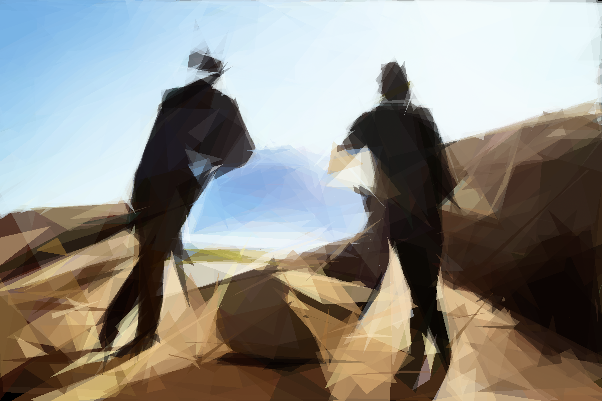
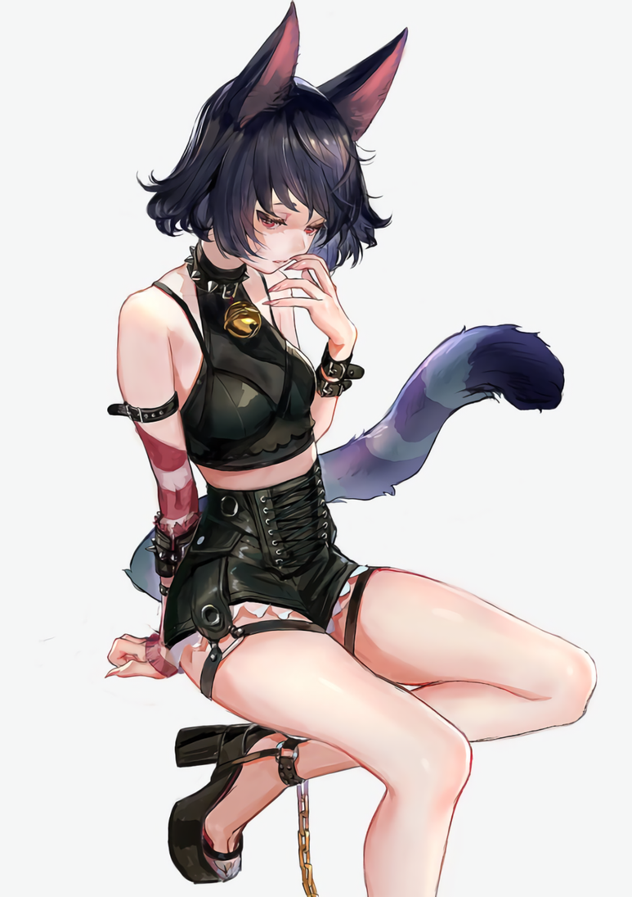

# Image Decompiler

Arranges triangles in order to minimize the difference between the framebuffer and the source image.

Currently only handles PNG images.

## How It Works:

The goal of the image decompiler is to produce:

1. A list of colored semi-transparent triangles approximating a source image
2. Screenshots tracking the progress of the triangle list

The process of creating the list of triangles is as follows:

0. Read in parameters from user, such as source png image and maximum triangle count
1. Create N primary and N secondary canvases
2. Create N empty triangle lists
3. Add a small triangle with random color and random position to the current most optimal list
4. Set the frame counter to 0
5. Create N - 1 variations of the current most optimal list. These variations are each a random 'distance' and random 'direction' away parameter-wise, and biased towards changing the most recently added triangle
6. For the N primary canvases: draw the triangle lists into the canvases
7. For N secondary canvases: draw the absolute value of the difference between the source image and the primary canvas into the secondary canvas
8. For N secondary canvases: determine the average value of the difference (top mipmap value)
9. Choose the canvas with the lowest average difference and set it as the current most optimal list
10. Save a screenshot once every M minutes
11. Handle user input
12. Add one to the frame counter
13. If the triangle list is full or the frame counter is less than F: goto 4
14. goto 3

## __Dependencies:__

* OpenGL 4.3
* glew
* glfw3
* glm
* c++11 compiler
* cmake
  
## __Building:__

* mkdir build
* cd build
* cmake .. -G "*your platform*"
* cd ..
* cmake --build build --config Release

## __Running:__

* cd bin
* ./main -image=example.png -brush=stardust.png -maxPrimitives=3000 -framesPerPrimitive=500 -primAlpha=0.75 -secondsPerScreenshot=180

## Highlights

### 

| "Concept Art: Moira" for Blizzard's Overwatch via https://playoverwatch.com/en-us/heroes/moira/ |
|--------------------------------------------------------------------------------------------------|
| Source |
|  |
| 88 Triangles |
|  |
| 502 Triangles |
|  |
| 1501 Triangles |
|  |
| 3000 Triangles |
|  |

| Photograph by spacey @spaceUMM https://twitter.com/spaceUMM |
|-------------------------------------------------------------|
| Source |
|  |
| 507 Triangles |
|  |
| 2509 Triangles |
|  |
| 5003 Triangles |
|  |
| 10000 Triangles |
|  |

| "Cities IV Deconstructed: Illustration Series" by Atelier Olschinsky via https://www.behance.net/gallery/2632147/Cities-IV-Deconstructed |
| -------------------------------------------------------------|
| Source |
|  |
| 79 Triangles |
|  |
| 251 Triangles |
|  |
| 509 Triangles |
|  |
| 1000 Triangles |
|  |

| Photograph of Daft Punk by Dave Hill http://www.davehillphoto.com/ |
|--------------------------------------------------------------------|
| Source |
|  |
| 256 Triangles |
|  |
| 502 Triangles |
|  |
| 1506 Triangles |
|  |
| 3000 Triangles |
|  |

| Illustration by LAL!ROLE @Laxxxli https://twitter.com/Laxxxli |
|---------------------------------------------------------------|
| Source |
|  |
| 160 Triangles |
|  |
| 504 Triangles |
|  |
| 1508 Triangles |
|  |
| 3000 Triangles |
|  |
